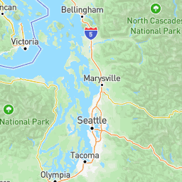
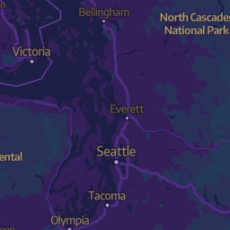
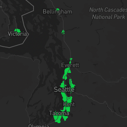
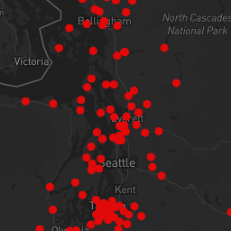

# Laboratory 4

[Map with tilesets](http://127.0.0.1:5500/index.html)

In the website you will see four tilesets each showing Seattle with a theme or different perspective. The main point of the entire website is for people to use public resources, especially UW students. 

The first tileset shows a satellite map of Seattle. This is a way for people to reference themselves as it is what most people are used to seeing. 

The second map is a UW tileset and is a themed map, the theme being UW. 

Tileset three shows Seattle and the public parks. Even though this is titled green lava, it is not entirely the point. It is meant as a form for people to see parks nearby where they live. 

Tileset four shows the public Wi-Fi locations, mainly this has to do with locations that are public libraries. I have met many UW commuters who find it hard to study at home but also struggle to commute to UW. This allows them to find a library near them.
